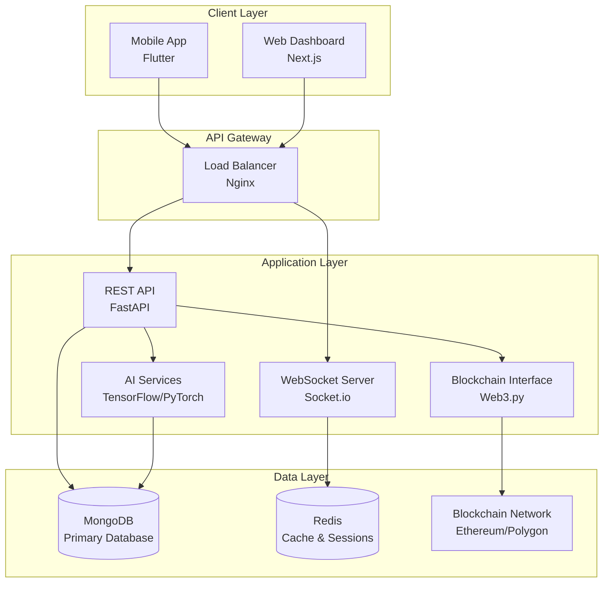
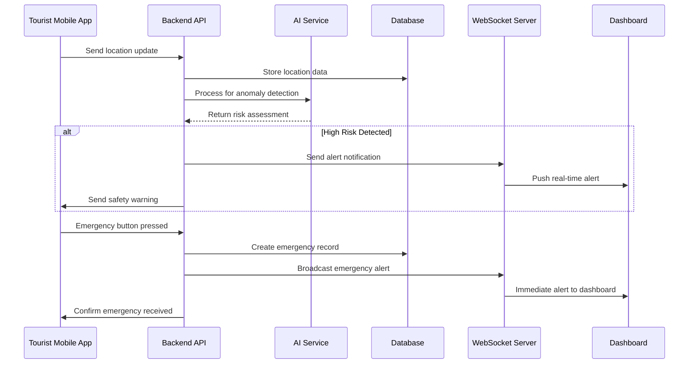
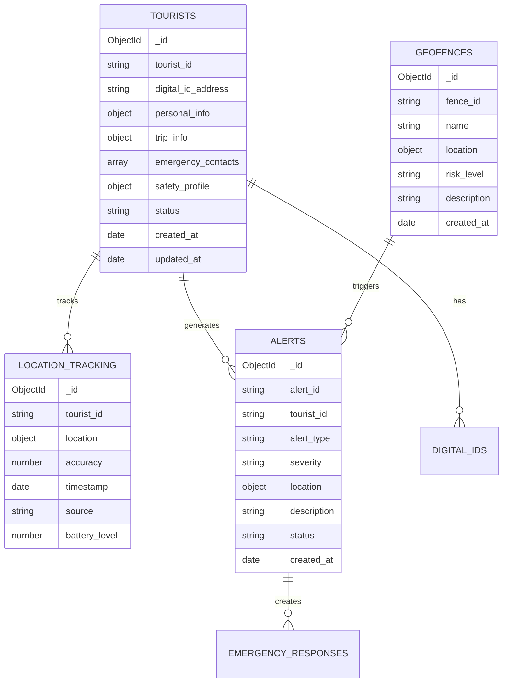

# Smart Tourist Safety Monitoring & Incident Response System
## Complete Guide for Technical and Non-Technical Audiences

---

## Table of Contents

1. [Executive Summary](#executive-summary)
2. [Problem Statement & Solution Overview](#problem-statement--solution-overview)
3. [System Components Overview](#system-components-overview)
4. [How the System Works](#how-the-system-works-non-technical-explanation)
5. [Core Features and Benefits](#core-features-and-benefits)
6. [Technology Foundation](#technology-foundation)
7. [Digital Tourist ID System](#digital-tourist-id-system)
8. [Mobile Application Details](#mobile-application-details)
9. [Web Dashboard for Authorities](#web-dashboard-for-authorities)
10. [AI and Smart Detection](#ai-and-smart-detection)
11. [Security and Privacy](#security-and-privacy)
12. [Multi-language Support](#multi-language-support)
13. [Real-World Usage Scenarios](#real-world-usage-scenarios)
14. [Technical Architecture](#technical-architecture-for-developers)

---
### Live Dashboard Production Link : https://gov-police-dashboard-sih.vercel.app
### Token Generation: https://police-token-generation.vercel.app

Tourist APK: [](https://github.com/Rohit-Solanki-6105/doc-sih-25002/releases/download/App/tourist_app_debug_prototype.apk)

### Project Overview

**Problem Statement ID**: 25002  
**Organization:** Ministry of Development of North Eastern Region  
**Department:** Ministry of Tourism / Ministry of Home Affairs  
**Category:** Software  
**Theme:** Travel & Tourism  

### Problem Statement

Development of a comprehensive Smart Tourist Safety Monitoring & Incident Response System leveraging AI, Blockchain, and Geo-Fencing technologies to ensure tourist safety in high-risk regions, particularly in Northeast India.

### Technology Stack

- **Mobile Application:** Flutter
- **Web Portal:** Next.js
- **Backend & Real-time Communication:** Python (FastAPI/Flask + Socket.io)
- **Database:** MongoDB
- **Blockchain:** Ethereum/Polygon for Digital ID
- **AI/ML:** Python (TensorFlow/PyTorch)
- **Real-time Features:** WebSocket connections

---


## Executive Summary

The Smart Tourist Safety Monitoring & Incident Response System is a comprehensive digital solution designed to ensure tourist safety in high-risk regions, particularly in Northeast India. This system combines cutting-edge technology with user-friendly interfaces to create a protective ecosystem for travelers.

### Key Highlights:
- **Digital ID System**: Blockchain-based secure identification for all tourists
- **Real-time Monitoring**: 24/7 location tracking and safety assessment
- **Instant Emergency Response**: One-touch emergency alerts with automatic authority notification
- **AI-Powered Risk Detection**: Smart algorithms that predict and prevent dangerous situations
- **Multi-language Support**: Communication in local languages for better accessibility

### Live System Links:
- **Dashboard**: https://gov-police-dashboard-sih.vercel.app
- **Token Generation**: https://police-token-generation.vercel.app
- **Mobile App**: [Download Tourist APK](https://github.com/Rohit-Solanki-6105/doc-sih-25002/releases/download/App/tourist_app_debug_prototype.apk)

---

## Problem Statement & Solution Overview

### The Challenge
Tourist safety in remote and culturally diverse regions presents unique challenges:
- **Communication barriers** between tourists and local authorities
- **Limited emergency response infrastructure** in remote areas
- **Difficulty in tracking** tourist movements in vast geographical areas
- **Delayed emergency response** due to communication gaps
- **Lack of real-time risk assessment** for tourist locations

### Our Solution
A comprehensive digital ecosystem that:
1. **Prevents incidents** through proactive monitoring and risk assessment
2. **Enables rapid response** when emergencies occur
3. **Bridges communication gaps** through multilingual support
4. **Provides authorities** with real-time information for better decision-making
5. **Creates a safety network** connecting tourists, local authorities, and emergency services

---

## System Components Overview

The system consists of four main components working together seamlessly:

### 1. Mobile Application (For Tourists)
- Personal safety companion
- Emergency alert system
- Real-time location sharing
- Safety score monitoring

### 2. Web Dashboard (For Authorities)
- Central monitoring station
- Emergency response coordination
- Tourist tracking and analytics
- Incident management

### 3. Digital ID Platform
- Secure tourist identification
- Trip planning integration
- Emergency contact management
- Blockchain-based verification

### 4. Backend Intelligence System
- AI-powered risk detection
- Real-time data processing
- Communication hub
- Database management

---

## How the System Works

Think of this system as a **digital safety net** for tourists. Here's how it works in simple terms:

### Step 1: Tourist Registration
When a tourist plans to visit, they register online and receive a **Digital Tourist ID** - like a digital passport that contains their trip details, emergency contacts, and safety preferences.

### Step 2: Mobile App Installation
Tourists download a mobile app that becomes their **personal safety companion**. This app:
- Knows where they are at all times (with their permission)
- Monitors their safety status
- Provides emergency help at the touch of a button

### Step 3: Continuous Monitoring
While tourists explore, the system:
- **Watches their location** to ensure they're in safe areas
- **Calculates safety scores** based on various factors
- **Alerts authorities** if something seems wrong
- **Provides real-time updates** to family and emergency contacts

### Step 4: Emergency Response
If an emergency occurs:
- Tourist presses the **panic button** on their phone
- System **immediately alerts** local police and emergency services
- **Shares exact location** and tourist information with authorities
- **Notifies emergency contacts** automatically
- **Generates incident reports** for follow-up

---

## Core Features and Benefits

### For Tourists

#### Safety Features
- **Personal Safety Score**: Real-time assessment of your current safety level
- **Panic Button**: One-touch emergency alert system
- **Safe Zone Alerts**: Notifications when entering high-risk areas
- **Location Sharing**: Share your location with family and friends
- **Offline Emergency**: Works even when internet connectivity is poor

#### Convenience Features
- **Digital Tourist ID**: No need for multiple documents
- **Trip Planning**: Integrated itinerary management
- **Local Information**: Access to local emergency numbers and services
- **Multi-language Support**: Interface in your preferred language

### For Authorities

#### Monitoring Capabilities
- **Real-time Tourist Tracking**: See all registered tourists on a map
- **Risk Assessment Dashboard**: Identify high-risk situations before they escalate
- **Heat Maps**: Understand tourist movement patterns and risk zones
- **Alert Management**: Prioritize and respond to emergency situations

#### Response Tools
- **Automatic E-FIR Generation**: Electronic First Information Reports created instantly
- **Emergency Coordination**: Direct communication with multiple response teams
- **Tourist Information Access**: Complete tourist profiles for better assistance
- **Analytics and Reporting**: Insights for improving tourist safety measures

---

## Technology Foundation

### Understanding the Technology Stack (Simplified)

Our system uses several proven technologies working together:

#### Mobile Technology
- **Flutter**: Cross-platform development framework that ensures the app works identically on both Android and iOS devices
- **GPS Integration**: Precise location tracking using satellite technology
- **Real-time Communication**: Instant messaging between app and monitoring systems

#### Web Technology
- **Next.js**: Modern web framework for creating fast, responsive dashboards
- **Real-time Updates**: Live information updates without page refreshes
- **Responsive Design**: Works on computers, tablets, and mobile devices

#### Backend Systems
- **Python**: Programming language known for reliability and AI capabilities
- **MongoDB**: Database system that handles large amounts of tourist data efficiently
- **Socket.io**: Technology enabling real-time communication between all system components

#### Security & Blockchain
- **Blockchain Technology**: Tamper-proof digital ID system using distributed ledger
- **End-to-End Encryption**: All sensitive data is encrypted during transmission and storage
- **Multi-layer Security**: Multiple security measures to protect tourist privacy

---

## Digital Tourist ID System

### What is a Digital Tourist ID?

A Digital Tourist ID is like a **smart passport** that contains all necessary information about a tourist's visit in a secure, digital format.

### Benefits of Digital ID

#### For Tourists:
- **Single Document**: Replaces multiple physical documents
- **Instant Verification**: Quick identity confirmation at checkpoints
- **Emergency Information**: Immediate access to medical and contact information
- **Trip Integration**: Links to planned itinerary and accommodations

#### For Authorities:
- **Instant Verification**: Immediately confirm tourist identity and legitimacy
- **Emergency Access**: Quick access to tourist's emergency contacts and medical info
- **Trip Visibility**: Understanding of tourist's planned activities and duration
- **Fraud Prevention**: Blockchain technology prevents ID tampering or duplication

### How Digital IDs are Created

#### Registration Process:
1. **Personal Information**: Tourist provides basic personal details
2. **Document Verification**: Passport/Aadhaar verification through secure APIs
3. **Trip Planning**: Input planned itinerary and accommodation details
4. **Emergency Contacts**: Add family/friend contact information
5. **Blockchain Recording**: All information is securely recorded on blockchain
6. **ID Generation**: Unique digital ID is created and linked to mobile app

### Security Features

#### Blockchain Protection:
- **Immutable Records**: Once created, IDs cannot be altered without detection
- **Decentralized Storage**: Information is stored across multiple secure nodes
- **Cryptographic Security**: Advanced encryption protects all personal data
- **Audit Trail**: Complete history of all ID-related activities

---

## Mobile Application Details

### User Interface Design

The mobile app is designed with **simplicity and emergency access** as top priorities:

#### Main Dashboard:
- **Large Safety Score Display**: Current safety status at a glance
- **Emergency Button**: Prominently placed for instant access
- **Location Status**: Current location and nearby safety information
- **Quick Actions**: Easy access to frequently used features

#### Emergency Features:
- **Panic Button**: Large, easily accessible emergency trigger
- **Voice Emergency**: Speak emergency requests in local language
- **Automatic Location Sharing**: GPS coordinates sent automatically during emergencies
- **Offline Functionality**: Basic emergency features work without internet

### Key Functionalities

#### Location Services:
- **Continuous Tracking**: GPS monitoring with user consent
- **Geofencing**: Automatic alerts when entering designated areas
- **Location History**: Track of visited places for safety analysis
- **Family Sharing**: Optional location sharing with designated contacts

#### Safety Monitoring:
- **Dynamic Safety Score**: Real-time calculation based on multiple factors
- **Risk Alerts**: Proactive warnings about potential safety concerns
- **Safe Route Suggestions**: Recommendations for safer travel paths
- **Local Emergency Numbers**: Quick access to relevant contact information

#### Communication Features:
- **Multi-language Interface**: Support for regional languages
- **Voice Commands**: Emergency activation through voice in local language
- **Text Translation**: Basic translation for emergency communication
- **Offline Messages**: Store emergency messages for later transmission

### Safety Score Algorithm (Simplified Explanation)

The app calculates a **Personal Safety Score** based on:

#### Location Factors:
- **Area Safety Rating**: Historical crime data and risk assessment
- **Time of Day**: Higher risk during night hours
- **Crowd Density**: Safer areas typically have more people
- **Proximity to Help**: Distance from police stations, hospitals

#### Behavioral Factors:
- **Route Deviation**: Staying close to planned itinerary
- **Communication Frequency**: Regular app activity indicates safety
- **Movement Patterns**: Unusual movement might indicate distress
- **Check-in Status**: Regular location confirmations

#### Environmental Factors:
- **Weather Conditions**: Extreme weather increases risk
- **Local Events**: Festivals, protests, or other gatherings
- **Transportation Status**: Availability of safe transportation
- **Communication Infrastructure**: Mobile network reliability

#### Personal Factors:
- **Health Status**: Any reported medical conditions
- **Travel Experience**: First-time vs. experienced travelers
- **Group Size**: Solo vs. group travel considerations
- **Emergency Preparedness**: Completion of safety briefings

---

## Web Dashboard for Authorities

### Dashboard Overview

The web dashboard serves as a **command center** for tourist safety monitoring and emergency response.

### Main Features

#### Real-time Monitoring:
- **Interactive Map**: Live view of all registered tourists
- **Status Indicators**: Color-coded safety levels for quick assessment
- **Alert Panel**: Real-time emergency and safety alerts
- **Communication Hub**: Direct messaging with tourists and response teams

#### Analytics and Insights:
- **Tourist Flow Analysis**: Understanding movement patterns and popular destinations
- **Risk Assessment Maps**: Heat maps showing high-risk areas and times
- **Incident Tracking**: Complete history of safety incidents and responses
- **Performance Metrics**: Response times and resolution rates

### Emergency Response Features

#### Alert Management:
- **Priority Classification**: Automatic categorization of alerts by severity
- **Response Team Assignment**: Automatic dispatch of appropriate response resources
- **Status Tracking**: Real-time monitoring of emergency resolution progress
- **Communication Log**: Complete record of all emergency communications

#### Information Access:
- **Complete Tourist Profiles**: Instant access to all relevant tourist information
- **Medical Information**: Emergency medical details and allergies
- **Emergency Contacts**: Direct access to tourist's designated emergency contacts
- **Trip Details**: Planned itinerary and accommodation information

### E-FIR (Electronic First Information Report) System

#### Automatic Generation:
When an emergency occurs, the system automatically creates an E-FIR containing:
- **Incident Details**: Time, location, and nature of emergency
- **Tourist Information**: Complete profile and trip details
- **Response Actions**: All actions taken by authorities
- **Evidence Collection**: Photos, recordings, and witness statements
- **Status Updates**: Real-time progress of investigation/resolution

#### Legal Integration:
- **Official Documentation**: Legally valid electronic reports
- **Chain of Custody**: Tamper-proof record of evidence handling
- **Multi-language Support**: Reports generated in required official languages
- **Integration with Legal Systems**: Direct submission to judicial databases

---

## AI and Smart Detection

### Understanding AI in Tourist Safety

Our system uses **Artificial Intelligence** to predict and prevent dangerous situations before they become emergencies.

### How AI Enhances Safety

#### Pattern Recognition:
- **Normal Behavior Learning**: AI understands typical tourist movement patterns
- **Anomaly Detection**: Identifies unusual behavior that might indicate distress
- **Risk Prediction**: Forecasts potential safety issues based on multiple data points
- **Preventive Alerts**: Warns tourists and authorities before situations escalate

### Types of AI Detection

#### Location Anomaly Detection:
- **Route Deviation**: Identifies when tourists significantly deviate from planned routes
- **Unusual Locations**: Alerts when tourists enter known high-risk areas
- **Movement Speed**: Detects unusually fast or slow movement patterns
- **Location Frequency**: Identifies if tourists are trapped in one location

#### Communication Anomaly Detection:
- **Silence Periods**: Alerts when tourists haven't communicated for extended periods
- **Message Content Analysis**: Identifies distress signals in tourist communications
- **Frequency Changes**: Notices sudden changes in communication patterns
- **Emergency Keywords**: Recognizes emergency-related terms in multiple languages

#### Behavioral Anomaly Detection:
- **Activity Pattern Changes**: Identifies significant changes in daily activity patterns
- **Social Interaction**: Monitors changes in social media activity or communication
- **App Usage Patterns**: Notices unusual mobile app usage that might indicate problems
- **Check-in Failures**: Alerts when expected check-ins don't occur

### AI Learning and Improvement

#### Continuous Learning:
- **Pattern Updates**: AI continuously learns new patterns from tourist behavior
- **False Positive Reduction**: System learns to reduce unnecessary alerts
- **Regional Adaptation**: AI adapts to local conditions and cultural patterns
- **Seasonal Adjustments**: Accounts for seasonal variations in tourist behavior and risks

---

## Security and Privacy

### Data Protection Principles

Our system follows **privacy-by-design** principles, ensuring tourist data is protected at every level.

### Security Measures

#### Data Encryption:
- **End-to-End Encryption**: All data is encrypted from source to destination
- **At-Rest Encryption**: Stored data is encrypted in databases
- **In-Transit Protection**: Data transmission is secured using advanced protocols
- **Key Management**: Sophisticated encryption key management system

#### Access Control:
- **Role-Based Access**: Different access levels for different user types
- **Multi-Factor Authentication**: Multiple verification steps for system access
- **Audit Logging**: Complete record of all system access and activities
- **Regular Access Reviews**: Periodic review and update of access permissions

#### Blockchain Security:
- **Immutable Records**: Tourist IDs cannot be altered without detection
- **Distributed Storage**: Data stored across multiple secure nodes
- **Cryptographic Hashing**: Advanced mathematical protection of data integrity
- **Consensus Mechanisms**: Multiple nodes must agree before any data changes

### Privacy Protection

#### Data Minimization:
- **Need-to-Know Basis**: Only collect and store essential information
- **Purpose Limitation**: Data used only for stated safety purposes
- **Retention Limits**: Data deleted after specified time periods
- **User Control**: Tourists can control what data is shared and when

#### Consent Management:
- **Informed Consent**: Clear explanation of data collection and usage
- **Granular Control**: Users can choose specific types of data sharing
- **Withdrawal Rights**: Users can withdraw consent and delete data
- **Transparency Reports**: Regular reporting on data usage and protection measures

---


---

## 12. System Architecture (Simplified)

The system is built like a **safety network** connecting tourists, authorities, and technology.  
Below is a simplified view of how everything fits together:

```
┌─────────────────┐                           ┌───────────────────┐
│   Flutter App   │                           │   Next.js Web     │
│   (Tourist)     │                           │ (Dashboard & All) │
└─────────┬───────┘                           └─────────┬─────────┘
          │                                             │
          └─────────────────────────────────────────────┘
                                 │
              ┌─────────────────────────────────┐
              │        API Gateway              │
              │      (Load Balancer)            │
              └─────────────┬───────────────────┘
                            │
          ┌─────────────────────────────────────────┐
          │           Python Backend                │
          │  ┌─────────────┐  ┌─────────────────┐   │
          │  │   FastAPI   │  │  Socket.io      │   │
          │  │   Server    │  │  Server         │   │
          │  └─────────────┘  └─────────────────┘   │
          │  ┌─────────────┐  ┌─────────────────┐   │
          │  │   AI/ML     │  │  Blockchain     │   │
          │  │  Services   │  │   Interface     │   │
          │  └─────────────┘  └─────────────────┘   │
          └─────────────┬───────────────────────────┘
                        │
    ┌───────────────────┼───────────────────┐
    │                   │                   │
┌───▼────┐    ┌────────▼────────┐    ┌─────▼─────┐
│MongoDB │    │   Blockchain    │    │   Redis   │
│        │    │   Network       │    │   Cache   │
└────────┘    └─────────────────┘    └───────────┘
```

### Key Components in Simple Terms
- **Flutter App** → Tourists use this as their personal safety companion.  
- **Next.js Web Dashboard** → Authorities use this to monitor and respond to alerts.  
- **API Gateway** → Acts as the traffic controller, ensuring smooth communication.  
- **Python Backend** → The brain of the system, handling data, AI, and blockchain.  
- **MongoDB** → Stores all tourist and safety data securely.  
- **Blockchain Network** → Provides tamper-proof digital IDs for tourists.  
- **Redis Cache** → Makes the system fast by storing frequently accessed data.  

---
## Multi-language Support

### Language Accessibility

The system supports major languages spoken in Northeast India and common international languages.

### Supported Languages:
- **English**: Primary interface language
- **Hindi**: National language support
- **Assamese**: Local Northeast India language
- **Bengali**: Widely spoken in the region
- **Manipuri**: Local language support
- **Chinese**: For Chinese tourists
- **Japanese**: For Japanese tourists
- **German**: For European tourists

### Voice Emergency Features

#### Voice Recognition:
- **Emergency Keywords**: Recognition of "help," "emergency," etc., in multiple languages
- **Natural Speech**: Understanding of natural language emergency descriptions
- **Accent Adaptation**: System learns to understand different accents and dialects
- **Background Noise Filtering**: Emergency detection even in noisy environments

#### Voice Response:
- **Automated Responses**: System can speak responses in user's preferred language
- **Emergency Guidance**: Voice instructions for emergency procedures
- **Real-time Translation**: Basic translation for emergency communication with authorities
- **Offline Capability**: Voice features work even with limited internet connectivity

---

## Real-World Usage Scenarios

### Scenario 1: Solo Female Traveler

**Situation**: Sarah, a solo female traveler from Germany, is exploring remote areas of Meghalaya.

**How the System Helps**:
1. **Registration**: Sarah registers online and receives her Digital Tourist ID
2. **Trip Planning**: Her planned itinerary is stored and shared with authorities
3. **Real-time Monitoring**: Her location is continuously monitored for safety
4. **Evening Alert**: System notices she hasn't checked in at her planned accommodation
5. **Automatic Response**: Local police are notified to check on her welfare
6. **Resolution**: Police find her phone died, provide charging and confirm safety

### Scenario 2: Adventure Group Emergency

**Situation**: A group of trekkers gets lost in Arunachal Pradesh during bad weather.

**How the System Helps**:
1. **Group Registration**: All group members are registered with linked profiles
2. **Route Monitoring**: System tracks their progress along planned trekking route
3. **Weather Alert**: System detects severe weather and sends safety warnings
4. **Emergency Trigger**: Group leader uses panic button when they realize they're lost
5. **Immediate Response**: GPS coordinates sent to local rescue teams
6. **Coordination**: Dashboard helps coordinate multiple rescue agencies
7. **Resolution**: Rescue teams reach them using exact GPS coordinates

### Scenario 3: Medical Emergency

**Situation**: An elderly tourist has a heart attack while visiting a remote monastery.

**How the System Helps**:
1. **Medical Profile**: Tourist's medical conditions and allergies are in their digital ID
2. **Emergency Detection**: Companion uses emergency feature on mobile app
3. **Medical Info Sharing**: Medical history automatically shared with emergency services
4. **Language Support**: App provides emergency phrases in local language
5. **Rapid Response**: Nearest medical facility is contacted with complete medical information
6. **Family Notification**: Emergency contacts are automatically informed
7. **Follow-up**: System tracks medical treatment and recovery progress

### Scenario 4: Cultural Misunderstanding

**Situation**: Foreign tourists inadvertently enter a restricted religious area.

**How the System Helps**:
1. **Geofencing**: System detects entry into restricted area
2. **Immediate Alert**: Tourists receive respectful notification about restriction
3. **Guidance**: App provides information about local customs and proper procedures
4. **Authority Notification**: Local religious authorities are informed diplomatically
5. **Resolution**: Situation resolved peacefully with cultural education
6. **Learning**: System updates location information to prevent similar incidents

---

## Technical Architecture

### System Architecture Overview

The system follows a **microservices architecture** with clear separation of concerns and scalable components.

### High-Level Architecture Diagram



### Component Breakdown

#### Mobile Application (Flutter)
```dart
// App Structure
lib/
├── main.dart                 // App entry point
├── config/                   // Configuration files
├── services/                 // Business logic services
│   ├── auth_service.dart    // Authentication handling
│   ├── location_service.dart // GPS and location tracking
│   ├── emergency_service.dart // Emergency features
│   └── socket_service.dart  // Real-time communication
├── screens/                 // UI screens
│   ├── dashboard/           // Main dashboard
│   ├── emergency/           // Emergency features
│   ├── profile/             // User profile management
│   └── settings/            // App settings
├── widgets/                 // Reusable UI components
│   ├── safety_score_widget.dart
│   ├── panic_button.dart
│   └── map_widget.dart
└── models/                  // Data models
    ├── tourist.dart
    ├── location.dart
    └── alert.dart
```

#### Backend Services (Python)
```python
# FastAPI Application Structure
app/
├── main.py                  # FastAPI application entry
├── config/                  # Configuration management
├── models/                  # Data models (Pydantic)
│   ├── tourist.py
│   ├── location.py
│   ├── alert.py
│   └── blockchain.py
├── services/                # Business logic
│   ├── ai_service.py       # AI/ML processing
│   ├── blockchain_service.py # Blockchain interactions
│   ├── geofencing_service.py # Location-based services
│   ├── notification_service.py # Alert management
│   └── socket_service.py   # Real-time communication
├── api/                     # API endpoints
│   ├── tourists.py         # Tourist management
│   ├── location.py         # Location tracking
│   ├── alerts.py           # Alert handling
│   └── dashboard.py        # Dashboard data
└── utils/                   # Utility functions
    ├── database.py         # Database connections
    ├── security.py         # Security utilities
    └── helpers.py          # General helpers
```

### Data Flow Architecture



### Key Technical Components

#### 1. Real-time Communication System
```python
# WebSocket Implementation
import socketio
from fastapi import FastAPI

sio = socketio.AsyncServer(async_mode='asgi', cors_allowed_origins="*")

@sio.event
async def connect(sid, environ):
    print(f"Client {sid} connected")

@sio.event
async def location_update(sid, data):
    # Process location update
    await process_location_update(data)
    # Broadcast to dashboard if needed
    if data['alert_level'] > 'low':
        await sio.emit('tourist_location_update', data, room='dashboard')

@sio.event
async def emergency_alert(sid, data):
    # Handle emergency immediately
    await handle_emergency(data)
    # Notify all relevant parties
    await sio.emit('emergency_alert', data, room='authorities')
```

#### 2. AI Anomaly Detection
```python
import numpy as np
from sklearn.ensemble import IsolationForest
import tensorflow as tf

class AnomalyDetectionService:
    def __init__(self):
        self.isolation_forest = IsolationForest(contamination=0.1)
        self.neural_network = self.load_trained_model()
    
    def detect_location_anomaly(self, tourist_id, current_location, location_history):
        """Detect if current location is anomalous based on history"""
        features = self.extract_location_features(current_location, location_history)
        
        # Use isolation forest for outlier detection
        is_anomaly = self.isolation_forest.predict([features])[0] == -1
        
        # Use neural network for risk assessment
        risk_score = self.neural_network.predict([features])[0]
        
        return {
            'is_anomaly': is_anomaly,
            'risk_score': float(risk_score),
            'confidence': self.calculate_confidence(features)
        }
    
    def extract_location_features(self, current_location, history):
        """Extract relevant features for anomaly detection"""
        # Distance from usual areas
        # Time of day
        # Speed of movement
        # Proximity to known safe/unsafe areas
        # Communication patterns
        return np.array([...])  # Feature vector
```

#### 3. Blockchain Integration
```python
from web3 import Web3
import json

class BlockchainService:
    def __init__(self):
        self.w3 = Web3(Web3.HTTPProvider(BLOCKCHAIN_RPC_URL))
        self.contract = self.load_smart_contract()
    
    def create_digital_id(self, tourist_data):
        """Create blockchain-based digital ID"""
        # Hash sensitive data
        kyc_hash = self.hash_sensitive_data(tourist_data['kyc_info'])
        itinerary_hash = self.hash_sensitive_data(tourist_data['itinerary'])
        
        # Create blockchain transaction
        transaction = self.contract.functions.issueTouristID(
            tourist_data['tourist_id'],
            kyc_hash,
            itinerary_hash,
            tourist_data['emergency_contacts']
        ).buildTransaction({
            'from': self.w3.eth.default_account,
            'gas': 2000000,
            'gasPrice': self.w3.toWei('20', 'gwei')
        })
        
        # Sign and send transaction
        signed_txn = self.w3.eth.account.signTransaction(transaction, PRIVATE_KEY)
        tx_hash = self.w3.eth.sendRawTransaction(signed_txn.rawTransaction)
        
        return tx_hash.hex()
    
    def verify_digital_id(self, tourist_id):
        """Verify digital ID on blockchain"""
        return self.contract.functions.verifyTouristID(tourist_id).call()
```

---

## Database Design

### MongoDB Schema Design

Our database uses MongoDB for flexibility and scalability in handling diverse tourist data.

#### Collections Overview



#### Detailed Schema Definitions

##### Tourists Collection
```javascript
{
  _id: ObjectId,
  tourist_id: String, // Unique identifier
  digital_id_address: String, // Blockchain address
  
  personal_info: {
    name: String,
    email: String,
    phone: String,
    nationality: String,
    passport_number: String,
    aadhaar_hash: String, // Hashed for privacy
    date_of_birth: Date,
    gender: String,
    photo_hash: String // Encrypted photo reference
  },
  
  trip_info: {
    entry_point: String,
    entry_date: Date,
    planned_departure: Date,
    purpose: String, // tourism, business, medical, etc.
    planned_itinerary: [
      {
        location: String,
        planned_arrival: Date,
        planned_departure: Date,
        accommodation: String,
        activities: Array
      }
    ],
    travel_group: {
      group_id: String,
      group_size: Number,
      group_leader: String
    }
  },
  
  emergency_contacts: [
    {
      name: String,
      relation: String,
      phone: String,
      email: String,
      is_primary: Boolean
    }
  ],
  
  medical_info: {
    blood_type: String,
    allergies: Array,
    medications: Array,
    medical_conditions: Array,
    emergency_medical_contact: String
  },
  
  safety_profile: {
    current_score: Number, // 0-100
    risk_level: String, // low, medium, high, critical
    last_location: {
      type: "Point",
      coordinates: [Number, Number] // [longitude, latitude]
    },
    last_activity: Date,
    communication_frequency: String,
    safety_preferences: {
      location_sharing: Boolean,
      emergency_auto_alert: Boolean,
      family_notifications: Boolean
    }
  },
  
  app_settings: {
    language_preference: String,
    notification_settings: Object,
    privacy_settings: Object
  },
  
  status: String, // active, inactive, emergency, completed
  created_at: Date,
  updated_at: Date,
  
  // Indexes for performance
  indexes: [
    { "tourist_id": 1 }, // Unique
    { "status": 1, "created_at": -1 },
    { "safety_profile.last_location": "2dsphere" },
    { "trip_info.entry_date": 1, "trip_info.planned_departure": 1 }
  ]
}
```

##### Location Tracking Collection
```javascript
{
  _id: ObjectId,
  tourist_id: String,
  
  location: {
    type: "Point",
    coordinates: [Number, Number] // [longitude, latitude]
  },
  
  location_details: {
    accuracy: Number, // GPS accuracy in meters
    altitude: Number,
    speed: Number, // km/h
    heading: Number, // degrees
    address: String // Reverse geocoded address
  },
  
  device_info: {
    source: String, // 'mobile', 'iot_device', 'manual'
    device_id: String,
    battery_level: Number,
    network_type: String, // '4G', '3G', 'WiFi', 'offline'
    app_version: String
  },
  
  context: {
    activity_type: String, // walking, driving, stationary
    is_planned_location: Boolean,
    deviation_from_route: Number, // meters
    time_at_location: Number, // minutes
    nearby_tourists: Array, // Other tourists in vicinity
    weather_conditions: String
  },
  
  timestamp: Date,
  processed_at: Date,
  
  // Indexes for performance
  indexes: [
    { "tourist_id": 1, "timestamp": -1 },
    { "location": "2dsphere" },
    { "timestamp": -1 },
    { "tourist_id": 1, "processed_at": 1 }
  ]
}
```

##### Alerts Collection
```javascript
{
  _id: ObjectId,
  alert_id: String, // Unique alert identifier
  tourist_id: String,
  
  alert_details: {
    alert_type: String, // 'geofence', 'panic', 'anomaly', 'inactivity', 'medical'
    severity: String, // 'low', 'medium', 'high', 'critical'
    title: String,
    description: String,
    auto_generated: Boolean
  },
  
  location_info: {
    location: {
      type: "Point",
      coordinates: [Number, Number]
    },
    address: String,
    geofence_id: String, // If geofence-related
    location_accuracy: Number
  },
  
  trigger_info: {
    triggered_by: String, // 'user', 'system', 'ai', 'authority'
    trigger_source: String, // 'mobile_app', 'dashboard', 'ai_service'
    trigger_data: Object, // Additional context data
    confidence_score: Number // For AI-generated alerts
  },
  
  response_info: {
    status: String, // 'active', 'acknowledged', 'in_progress', 'resolved', 'false_positive'
    assigned_to: String, // Officer/team handling the alert
    response_time: Number, // Minutes to first response
    resolution_time: Number, // Minutes to resolution
    actions_taken: [
      {
        action: String,
        performed_by: String,
        timestamp: Date,
        notes: String
      }
    ]
  },
  
  communication: {
    notifications_sent: [
      {
        recipient_type: String, // 'tourist', 'emergency_contact', 'authority'
        recipient_id: String,
        method: String, // 'push', 'sms', 'call', 'email'
        status: String, // 'sent', 'delivered', 'failed'
        timestamp: Date
      }
    ],
    messages: [
      {
        from: String,
        to: String,
        message: String,
        timestamp: Date,
        message_type: String // 'text', 'voice', 'location'
      }
    ]
  },
  
  created_at: Date,
  acknowledged_at: Date,
  resolved_at: Date,
  
  // Indexes for performance
  indexes: [
    { "tourist_id": 1, "status": 1, "created_at": -1 },
    { "alert_type": 1, "severity": 1, "created_at": -1 },
    { "status": 1, "created_at": -1 },
    { "location_info.location": "2dsphere" }
  ]
}
```

##### Geofences Collection
```javascript
{
  _id: ObjectId,
  fence_id: String, // Unique fence identifier
  
  fence_details: {
    name: String,
    description: String,
    fence_type: String, // 'safety', 'restricted', 'hospital', 'police', 'tourist_zone'
    risk_level: String, // 'safe', 'caution', 'high_risk', 'restricted'
    category: String // 'permanent', 'temporary', 'event_based'
  },
  
  geographical_info: {
    location: {
      type: "Polygon", // or "Circle" for circular geofences
      coordinates: Array // Array of coordinate arrays
    },
    center_point: {
      type: "Point",
      coordinates: [Number, Number]
    },
    radius: Number, // For circular geofences (meters)
    area: Number // Square kilometers
  },
  
  operational_info: {
    active_hours: {
      all_day: Boolean,
      start_time: String, // HH:MM format
      end_time: String,
      days_of_week: Array // ['monday', 'tuesday', etc.]
    },
    seasonal_restrictions: [
      {
        start_date: Date,
        end_date: Date,
        restriction_type: String,
        description: String
      }
    ]
  },
  
  alert_settings: {
    entry_alert: Boolean,
    exit_alert: Boolean,
    duration_threshold: Number, // Minutes before alert if staying too long
    auto_actions: [
      {
        trigger: String, // 'entry', 'exit', 'duration_exceeded'
        action: String, // 'notify_tourist', 'alert_authorities', 'send_warning'
        recipients: Array
      }
    ]
  },
  
  metadata: {
    created_by: String, // Authority/admin who created
    last_modified_by: String,
    modification_reason: String,
    approval_status: String, // 'pending', 'approved', 'rejected'
    priority: Number // 1-10 for processing priority
  },
  
  statistics: {
    total_entries: Number,
    total_exits: Number,
    alerts_generated: Number,
    last_activity: Date
  },
  
  created_at: Date,
  updated_at: Date,
  status: String, // 'active', 'inactive', 'under_review'
  
  // Indexes for performance
  indexes: [
    { "geographical_info.location": "2dsphere" },
    { "fence_type": 1, "status": 1 },
    { "risk_level": 1, "status": 1 },
    { "created_at": -1 }
  ]
}
```
